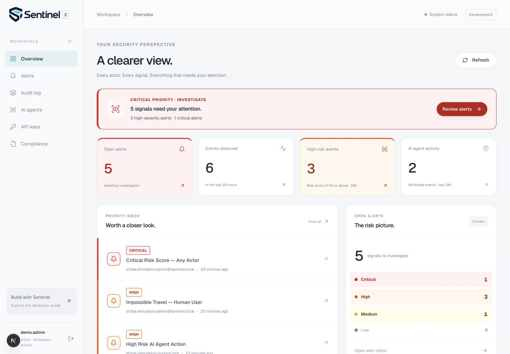
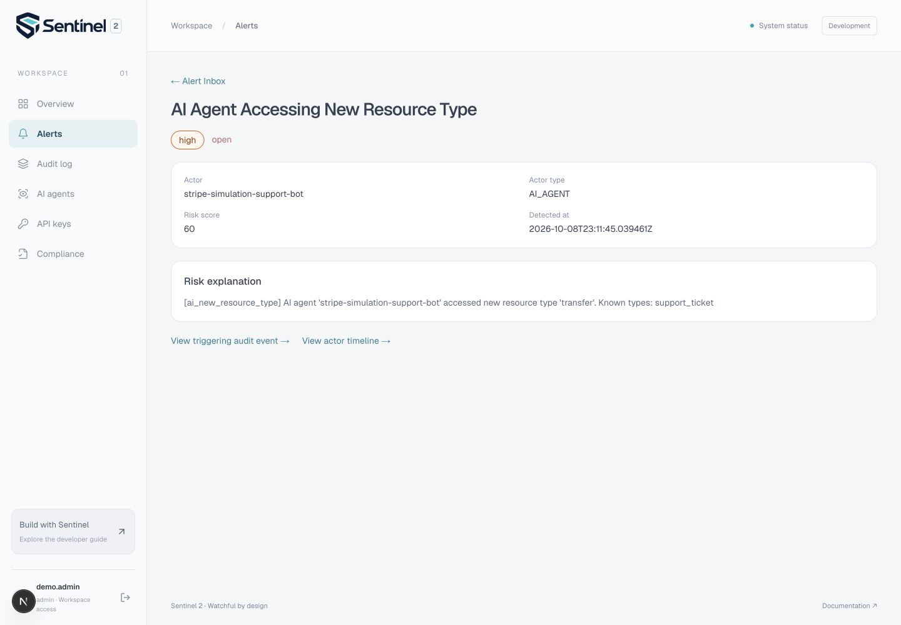
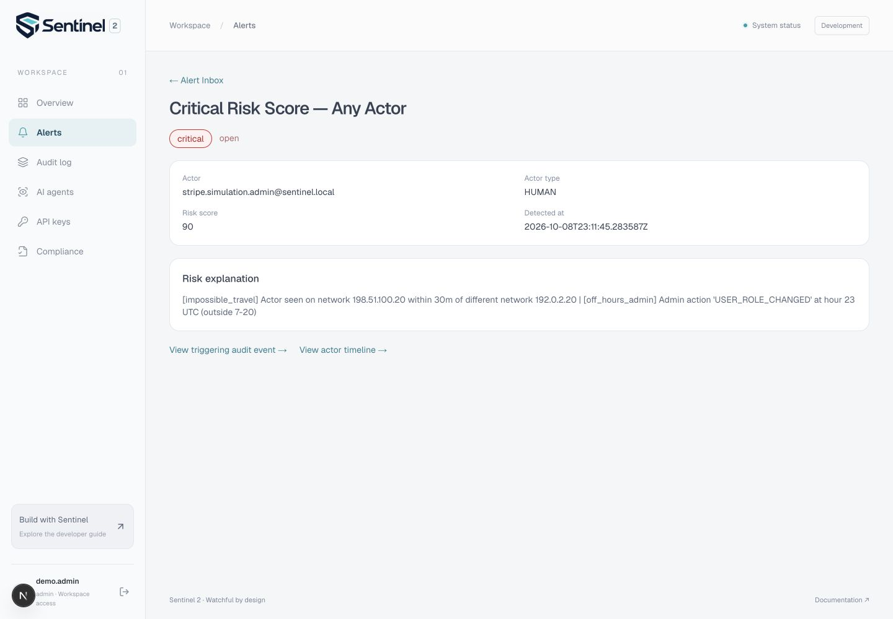
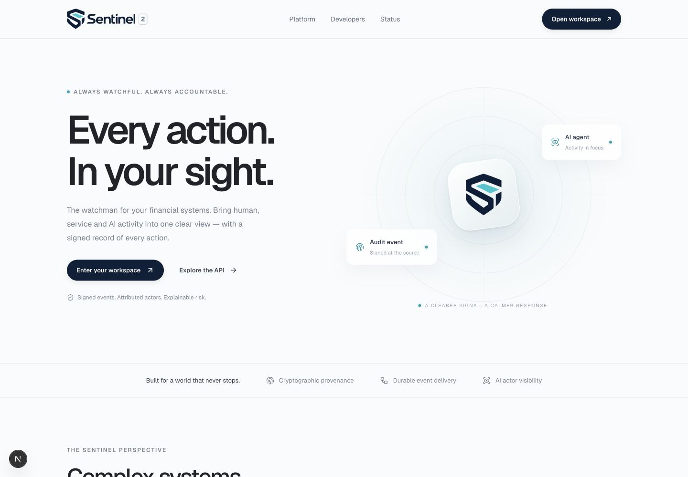
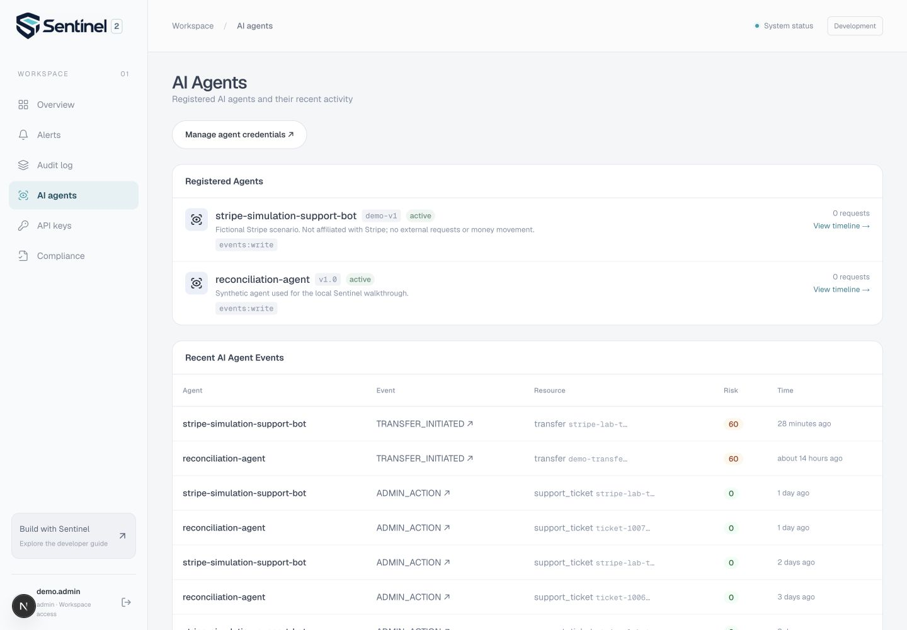
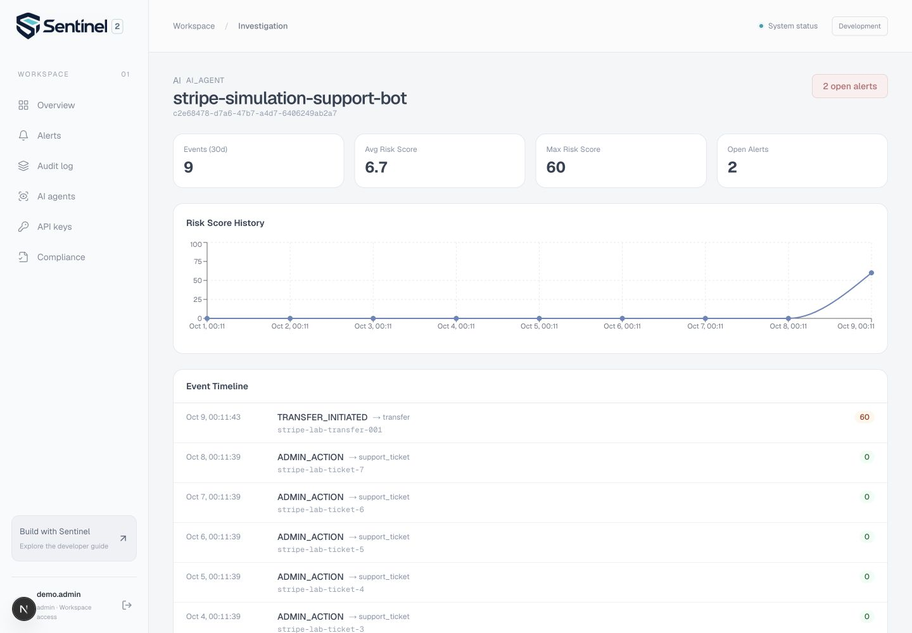
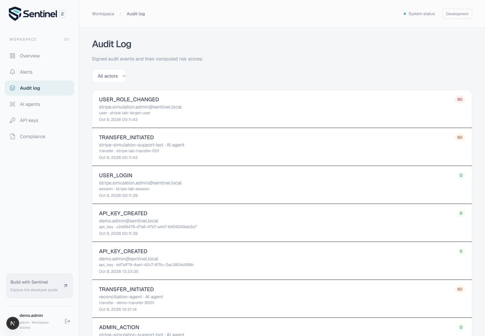
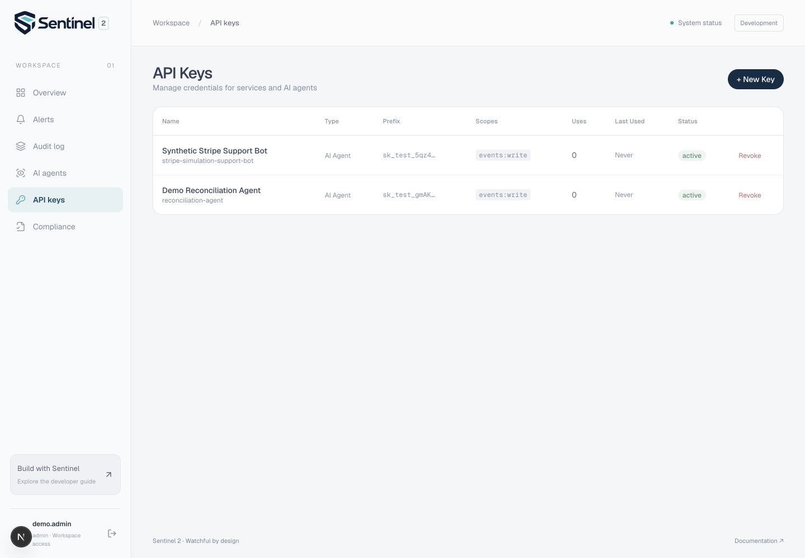
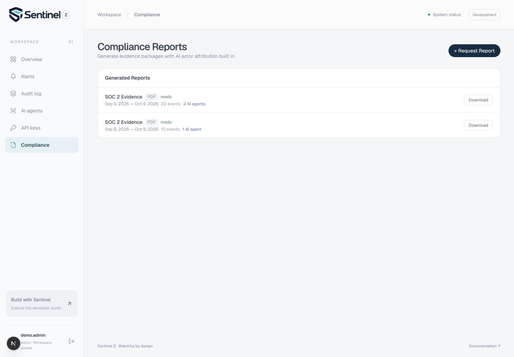

# Sentinel 2

Security and audit monitoring for applications where people, services and AI agents perform sensitive actions.

[](https://github.com/Gwerdonatus/Sentinel/actions?query=branch%3Afix%2Freliable-audit-pipeline)

A valid credential identifies a reporter. It does not tell an investigator whether the reported action fits that actor's normal behavior. Sentinel records activity, applies explainable risk rules, and links alerts to the event and actor history needed for investigation.

I built Sentinel as a solo engineering project to explore the boundaries between authenticated reporting, durable event delivery and behavioral risk scoring. It does not process payments or automatically block actions in another application.

## Product walkthrough

These are screenshots of the running application, using explicitly synthetic local data. The fictional Stripe scenario is a demonstration reference only: there is no affiliation, live integration or production incident. No money moved and no external permissions changed. Counts are snapshots, not throughput measurements.



The overview prioritizes open alerts and links them to investigations. One event can trigger several rules; the five alerts here come from two staged incidents.

### AI agent: an unexpected resource

A support bot's recorded history involves `support_ticket` resources. It then reports `TRANSFER_INITIATED` against a `transfer` resource. The new-resource signal contributes **60 points**, producing a high-risk event and two rule-based alerts.



### Human: network change and an off-hours action

A synthetic administrator reports a role change shortly after a login on a different network. The network-change heuristic contributes **85 points**; an additional off-hours admin signal adds **5**, producing a score of **90**. This is a reason to investigate, not proof of account compromise or geographic impossible travel.



<details>
<summary>More screens: homepage, actor timeline, audit history, credentials and exports</summary>

**Homepage.** Entry points to the workspace and integration guide.



**AI agents.** Registered identities link to recent activity and their investigation timelines.



**Actor timeline.** Compare routine activity with an elevated event.



**Audit log.** Inspect actions, actor identity, resources, timestamps and risk scores. Filter people, services and AI agents separately.



**Scoped credentials.** Credentials associate reporters with identities and limit access to Sentinel endpoints. Full key material is not shown.



**Evidence exports.** Asynchronous report generation produces downloadable PDF, CSV and JSON evidence. This completed PDF contains 22 events and names two AI agents; its actor summary totals 18 AI events and four human events. The report is an evidence package, not compliance certification.



</details>

See the [alert inbox screenshot](docs/screenshots/alerts.jpg), [screenshot provenance](docs/screenshots/README.md) and the [repeatable local walkthrough](docs/local-demo.md).

## What is implemented

| Area | Behavior |
|---|---|
| Audit events | Versioned HMAC signatures over protected event fields; application-level append-only records |
| Identity and access | JWT/RBAC, credential-derived actors and enforced API-key scopes |
| Risk scoring | Actor-specific rules with historical comparisons and readable explanations |
| Investigation | Alert inbox, event details, actor timeline, filters and acknowledgement/resolution workflow |
| Reliable delivery | PostgreSQL transactional outbox, acknowledged Kafka publishing, retries and idempotent alert creation |
| Evidence exports | PDF, CSV and JSON reports with actor and agent attribution |
| Operations | Compose stack, health checks, structured logs, metrics, traces, ADRs and runbooks |

A developer integrates their application with the event API. Investigators then sign into Sentinel to review that reported activity. Signing into the dashboard does not automatically connect an external system.

## How risk scores work

The engine uses rules, not an ML prediction or a probability of fraud:

```text
score = min(100, highest_fired_signal + min(15, 5 × additional_fired_signals))
```

| Score | Level |
|---|---|
| 0–24 | Low |
| 25–49 | Medium |
| 50–74 | High |
| 75–100 | Critical |

Applicable signals include new AI resource types, activity-volume changes, rapid human network changes and off-hours administrative actions. They are heuristics requiring business context. Read the [engine](apps/backend/sentinel/risk/engine.py), [signals](apps/backend/sentinel/risk/signals.py) and [regression tests](apps/backend/tests/unit/test_risk_engine.py).

## Delivery architecture

```mermaid
flowchart LR
    App[Instrumented application] --> API[Django API: authenticate and validate]
    API --> DB[PostgreSQL: event + outbox in one transaction]
    DB --> Publisher[Celery outbox publisher]
    Publisher -->|acknowledged delivery; retry on failure| Kafka[Kafka audit stream]
    Kafka --> Consumer[Risk consumer]
    Consumer --> Results[Risk scores + idempotent alerts]
    Results --> UI[Next.js investigation workspace]
```



PostgreSQL holds the durable record and publication intent. Celery handles publishing, schedules, notifications and report jobs. Kafka is the single risk-scoring trigger. Redis supports task transport and authentication state. Nginx routes the local app; Prometheus, Grafana and OpenTelemetry provide operational visibility.

**Why Kafka?** A retained stream supports replay and independent consumers. It also adds operational complexity. A single-consumer deployment could use a PostgreSQL outbox plus Celery more simply; this project explores stream processing rather than demonstrating a measured need for Kafka-scale throughput. See [ADR-018](docs/adr/adr-018-transactional-outbox-and-event-provenance.md).

## Verification

- Backend: **314 passing tests**, **72.58% coverage** (local run, 9 October 2026).
- Ruff lint/format, Django system checks and migration consistency.
- Frontend lint, TypeScript check and production build.
- Compose configuration validation and 14 running local services; nine configured health checks.
- Demo seeding twice preserves event and agent identity. Browser and HTTP investigation flows verified.

CI runs regression tests and backend/frontend checks when relevant paths change. Documentation-only jobs can be skipped; a green documentation run is not a fresh full-suite execution. Historical full-suite evidence: [run for 650e581](https://github.com/Gwerdonatus/Sentinel/actions/runs/37786851776).

See [local verification evidence and caveats](docs/verification.md). No ingestion p95, throughput benchmark, production deployment or third-party security audit is claimed.

## Run locally

The current runtime and product upgrades are on [`fix/reliable-audit-pipeline`](https://github.com/Gwerdonatus/Sentinel/tree/fix/reliable-audit-pipeline), tracked in [PR #1](https://github.com/Gwerdonatus/Sentinel/pull/1). The PR is not merged into `main`.

```sh
git clone https://github.com/Gwerdonatus/Sentinel.git
cd Sentinel
git switch fix/reliable-audit-pipeline
cp .env.example .env
docker compose config --quiet
docker compose up -d --build --wait --wait-timeout 300
docker compose exec backend python manage.py migrate
docker compose exec backend python manage.py seed_demo
```

Open **http://localhost:3000**. Local demo credentials:

- Email: `demo.admin@sentinel.local`
- Password: `SentinelDemo123!`

The seed command is disabled in production. Keep any one-time API key out of recordings and commits. Scoring is asynchronous; allow the publisher and consumer to finish. See [local-demo.md](docs/local-demo.md) for service URLs, isolation settings and recovery notes.

### Backend regression checks

Use a disposable container in test mode so regression events cannot reach the live demo broker:

```sh
docker compose run --rm --no-deps --user root \
  -e ENVIRONMENT=test -e KAFKA_ENABLED=False -e OTEL_ENABLED=False \
  backend sh -c 'pip install -r requirements-dev.txt && ruff check . && ruff format --check . && python manage.py check && pytest --cov=sentinel --cov-report=term-missing'
```

### Frontend checks

```sh
docker compose exec frontend npm run lint
docker compose exec frontend npx tsc --noEmit
docker compose run --rm --no-deps -e NODE_ENV=production \
  -e NEXT_DIST_DIR=.next frontend npm run build
```

## Security boundaries and remaining work

- HMAC detects changes to signed fields. It does not detect deleted/reordered records or forgery by a signing-key holder. Hash chaining and external anchoring are not implemented.
- Sentinel authenticates the reporter; it cannot independently prove every reported business detail or discover unreported actions.
- Behavioral anomalies do not establish fraud, prompt injection or compromise. The network detector is a coarse subnet heuristic.
- Delivery is at least once. Risk results are eventually consistent; a durable event can exist before a score appears.
- An evidence report supports review; it is not SOC 2 certification or a PCI-DSS compliance determination.
- Kubernetes/CD templates and tenancy infrastructure are present, but local operation does not establish production readiness, high availability or independently verified tenant isolation.
- External notifications need configured destinations; the local walkthrough verifies persisted in-app alerts.

## Repository map

| Path | Contents |
|---|---|
| [`apps/backend`](apps/backend) | Django API, audit, risk, identity and report services |
| [`apps/frontend`](apps/frontend) | Next.js product pages and investigation workspace |
| [`sdk`](sdk) | Python integration client |
| [`infra`](infra) | Docker, routing, deployment and observability configuration |
| [`docs`](docs) | Design decisions, architecture, security and runbooks |

[Architecture](docs/architecture.md) · [ADR index](docs/adr/README.md) · [Security policy](docs/security-policy.md) · [Contributing](docs/contributing.md) · [Roadmap](docs/roadmap.md)
